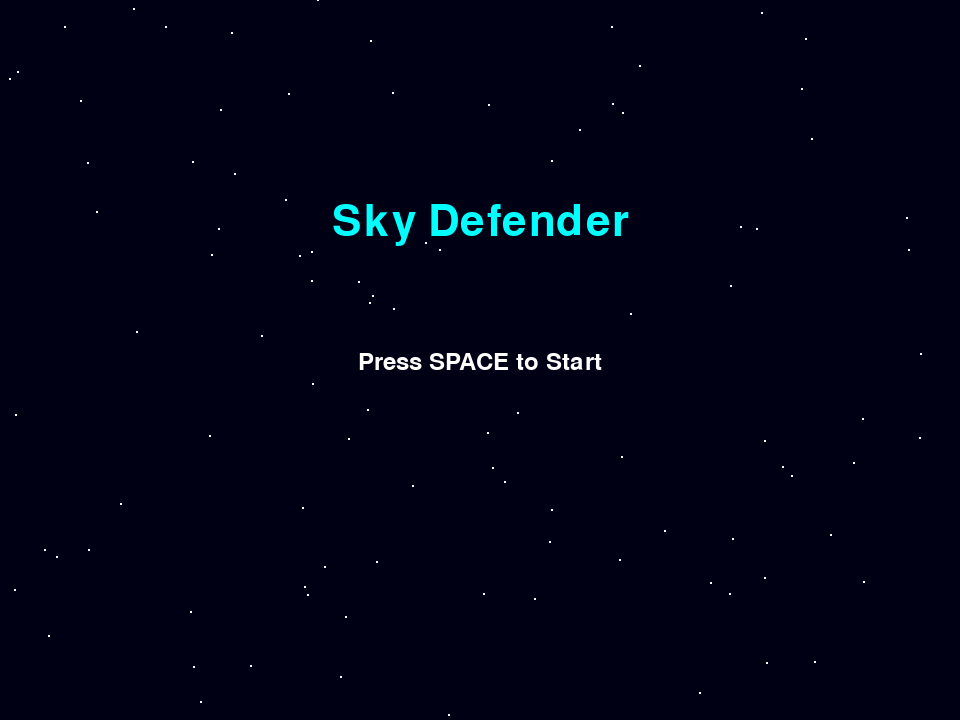

# Sky Defender - 天空防线

[](https://www.python.org/)
[](https://www.pygame.org/)
[](LICENSE)

一个完整的 100 关纵向卷轴射击游戏，使用 Python 和 Pygame 开发。



## 游戏特色

### 核心玩法
- 🎮 **100 关挑战**： progressively difficult levels with unique enemy patterns
- 🚀 **5 种武器系统**：机关枪、散弹枪、激光炮、追踪导弹、等离子球
- 💰 **商店系统**：使用金币购买武器解锁和升级项目
- ⚡ **技能系统**：能量炮和全屏清怪两个强力技能

### 视觉效果
- ✨ **发光效果**：敌人和技能都有华丽的发光效果
- 🎨 **精美素材**：完整的图像资源（玩家、敌人、BOSS、子弹、特效）
- 🌌 **动态背景**：星空滚动和星云效果

## 安装说明

### 环境要求
- Python 3.8 或更高版本
- Pygame 2.0 或更高版本

### 安装步骤

1. 克隆仓库
```bash
git clone https://github.com/sweetorangecat/aircraft_battle.git
cd aircraft_battle
```

2. 安装依赖
```bash
pip install pygame
```

3. 运行游戏
```bash
python main.py
```

## 操作指南

### 基础操作
| 按键 | 功能 |
|------|------|
| `WASD` / 方向键 | 移动战机 |
| `1-5` | 切换武器 |
| `Q` | 使用核弹 |
| `E` | 能量炮（需30能量） |
| `R` | 全屏清怪（需60能量） |
| `B` | 打开商店 |
| `ESC` | 暂停/返回 |

### 武器说明
1. **机关枪**：快速射击，适合清理小兵
2. **散弹枪**：扇形多发，近距离高伤害
3. **激光炮**：持续穿透，对直线敌人有效
4. **追踪导弹**：自动索敌，适合灵活目标
5. **等离子球**：穿透伤害，可穿透多个敌人

### 技能系统
- **能量炮**：向前方发射强力穿透光束，消耗30能量
- **全屏清怪**：秒杀所有普通敌人，BOSS损失15%血量，消耗60能量

能量获取：击杀敌人获得能量（普通+2，BOSS+5）

## 项目结构

```
aircraft_battle/
├── main.py              # 游戏入口
├── engine.py            # 游戏引擎与主循环
├── entities.py          # 游戏实体（玩家、敌人、BOSS）
├── weapons.py           # 武器系统
├── upgrades.py          # 升级系统
├── levels.py            # 关卡管理
├── effects.py           # 粒子特效
├── assets.py            # 资源管理
├── config.py            # 配置常量
├── process_assets.py    # 资源处理脚本
├── .gitignore           # Git忽略文件
├── README.md            # 项目说明
└── images/processed/    # 游戏图像资源
    ├── player_*.png     # 玩家战机
    ├── enemy_*.png      # 敌人
    ├── boss_*.png       # BOSS
    ├── bullet_*.png     # 子弹
    └── ...
```

## 开发计划

- [x] 基础游戏框架
- [x] 玩家控制和射击
- [x] 敌人和BOSS系统
- [x] 武器系统
- [x] 升级和商店系统
- [x] 技能系统
- [x] 粒子特效
- [x] 100关关卡设计
- [ ] 音效和音乐
- [ ] 存档系统
- [ ] 成就系统

## 贡献指南

欢迎提交 Issue 和 Pull Request！

1. Fork 本仓库
2. 创建你的特性分支 (`git checkout -b feature/AmazingFeature`)
3. 提交你的更改 (`git commit -m 'Add some AmazingFeature'`)
4. 推送到分支 (`git push origin feature/AmazingFeature`)
5. 打开一个 Pull Request

## 许可证

本项目采用 MIT 许可证 - 详见 [LICENSE](LICENSE) 文件

## 致谢

- 感谢 [Pygame](https://www.pygame.org/) 提供的游戏开发框架
- 感谢所有测试和反馈的玩家

---

**作者**: sweetorangecat

**GitHub**: [https://github.com/sweetorangecat/aircraft_battle](https://github.com/sweetorangecat/aircraft_battle)
